# 실행 컨텍스트와 콜스택

- 실행 컨텍스트란 뭘까?
    
    영어로는 Execution Context 이다.  그대로 해석해보면,
    
    - Execution = 실행
    - Context = 문맥 : 글이나 문장에 표현된 의미의 앞뒤 연결
    
    ⇒ 자바스크립트 실행의 앞뒤를 연결해주는 역할을 하는 것이다.
    

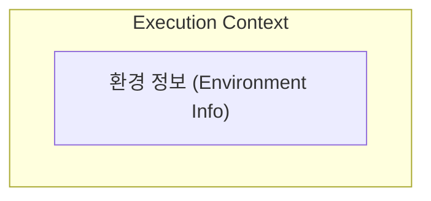

즉, 실행하려는 코드에 제공할 `환경 정보`들을 모아놓는 객체이다.

이렇게 생성된 **Execution Context**는 자바스크립트 엔진의 **Call Stack**이라는 곳에 차곡차곡 쌓이게 된다.

## 실행 컨텍스트의 역할

그렇다면 실행 컨텍스트가 왜 필요할까?

우리가 코드를 실행하는 과정에서는 다음과 같은 관리가 필요하다.

- 선언에 의해 생성된 **모든 식별자(변수, 함수 등)를 스코프를 구분해 등록**하고 식별자의 변화를 지속적으로 관리해야 한다.
- 스코프 체인을 통해 상위 스코프로 이동하며 식별자를 검색할 수 있어야 한다.
- 현재 실행 중인 **코드의 실행 순서를 변경**할 수 있어야 하며, 다시 돌아갈 수 있어야 한다.

이러한 모든 것을 관리해주는 것이 바로 실행 컨텍스트다.

실행 컨텍스트는 **소스코드를 실행하는 데 필요한 환경을 제공하고 코드의 실행 결과를 실제로 관리하는 영역**이다. 

실행 컨텍스트는 **식별자(변수, 함수, 클래스 등의 이름)를 등록하고 관리**하는 스코프와 **코드 실행 순서 관리**를 구현한 내부 메커니즘으로, 모든 코드는 실행 컨텍스트를 통해 실행되고 관리된다.

- **실행 컨텍스트 구성**
    
    1. **렉시컬 환경** : 식별자와 스코프를 관리한다.
    
    2. **실행 컨텍스트 스택** : 코드 실행 순서를 관리한다.
    

## 실행 컨텍스트의 생성

실행 컨텍스트는 자바스크립트 코드의 **평가 과정 중에 생성**됩니다.

### **소스코드의 평가와 실행**


모든 소스코드는 **`소스코드의 평가`**와 **`소스코드의 실행`** 과정으로 나누어 처리한다.

- **평가**
    
    **실행컨텍스트를 생성**하고 **변수, 함수 등의 선언문만 먼저 실행**하여 생성된 변수나 함수 식별자를 키로 실행 컨텍스트가 관리하는 스코프에 등록한다.
    
- **실행**
    
    **런타임 시작**. 소스코드 실행에 필요한 정보(변수나 함수의 참조)를 실행 컨텍스트가 관리하는 스코프에서 검색해 취득한다. 실행 결과는 실행 컨텍스트가 관리하는 스코프에 등록된다.
    

예시를 들어 좀 더 자세히 알아보겠습니다.

```jsx
var x = 1;
```

위 한 줄의 코드지만 자바스크립트 엔진은 위 예제를 2개의과정으로 나누어서 처리합니다.

먼저 소스코드 평가 과정에서 다음과 같이 선언문만 먼저 실행합니다.

```jsx
var x;
```

소스코드 평가를 통해 생성된 변수 식별자 x 는 실행 컨텍스트가 관리하는 스코프에 등록되고 `undefined`로 초기화 됩니다.

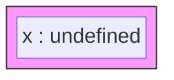

이후 평가 과정이 끝나면 소스코드 실행 과정이 시작된다. 이미 실행한 선언문을 제외한 코드를 실행하기 때문에 실행 과정에서는 변수 `x`에 1을 할당하는 할당문만 실행됩니다.

```jsx
x = 1;
```

여기서 `x`에 1을 할당하려면, 실행 컨텍스트가 관리하는 스코프에 등록된 변수 인지 확인해야한다. 

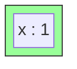

### 4가지 타입의 소스코드와 생성되는 실행 컨텍스트

- **전역 코드**
    - 전역에 존재하는 소스 코드
        
        ⇒ 함수, 클래스 등의 내부 코드 제외
        
    - 전역 코드의 평가되면 **전역 실행 컨텍스트** 생성
- **함수 코드**
    - 함수 내부에 존재하는 소스 코드
        
        ⇒ 중첩 코드 제외
        
    - 지역 스코프를 생성하고, 지역 변수, 매개변수, arguments 객체를 관리한다.
    - 함수 코드의 평가되면 **함수 실행 컨텍스트** 생성
- **eval 코드**
    - 빌트인 전역함수인 eval 함수에 인수로 전달되어 실행되는 소스 코드
    - eval 코드는 strict mode(엄격 모드) 에서 자신만의 독자적인 스코프를 생성
    - eval 코드의 평가되면 **eval 실행 컨텍스트** 생성
- **모듈 코드**
    - 모듈 내부에 존재하는 소스 코드
        
        ⇒ 함수, 클래스 등의 내부 코드 제외
        
    - 모듈별로 독립적인 모듈 스코프를 생성
    - 모듈 코드가 평가되면 **모듈 실행 컨텍스트** 실행

# 실행 컨텍스트 콜스택

자바스크립트의 실행 과정을 요약해보면 아래와 같다.

- **실행 컨텍스트**에는 간단하게 적으면, **Record**와 **Outer**가 들어있다.

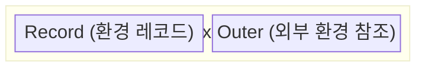
    
- 코드가 실행되면 자바스크립트 엔진은 **콜 스택(호출 스택)**에 **가장 먼저전역 실행 컨텍스트(Global context)** 를 담는다.
- 만약 전역에서 **다른 함수를 호출할 경우 해당 함수의 실행 컨텍스트**가 쌓이게된다.
- 이처럼 스택 형식으로 계속 쌓이게 되며 **현재 실행 중인 실행 컨텍스트**는 **가장 위에 있는 실행 컨텍스트**가 된다.
    
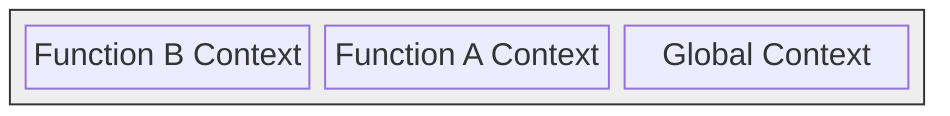
    
    Call Stack은 자료구조 'Stack'과 구조가 동일하여, 가장 나중에 추가된 맨 위의 실행 컨텍스트만 '활성화'되고, 그 실행 컨텍스트가 종료되어 스택에서 제거되고 나면, 다음 실행 컨텍스트를 활성화시키는 순서로 실행된다.
    
    ### 콜스텍 예시
    
```jsx
var temp = 'temp';

function b (){
  console.log('hello im function b');
}
    
function a (){
  b();
}
    
a();
```
    
    1. `전역 컨텍스트`가 콜스택에 담긴다.
        1. window, global 등 전역 객체가 이떄 할당된다.
            
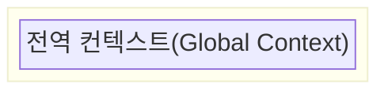
            
    2. 전역 컨텍스트와 관련된 코드 실행 중 함수 a를 실행했기 떄문에 a 함수의 환경 정보들을 모아 `a실행 컨텍스트를 생성하고 콜스택`에 담는다.
        1. 이때, a 실행 컨텍스트가 콜스택에 쌓이게 되면서 기존의 전역 컨텍스트와 관련된 코드의 실행을 일시적으로 중단한다.
            
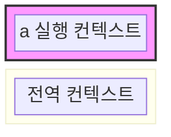
            
    3. a 함수 내부에서 b 함수를 호출했기 떄문에 2번 동작과 마찬가지로 `b 함수의 환경 정보를 수집하고 실행 컨텍스트를 생성하여 콜스택`에 담는다.
        1. 마찬가지로 a 함수 실행 컨텍스트와 관련된 코드의 실행을 일시중단한다.
            
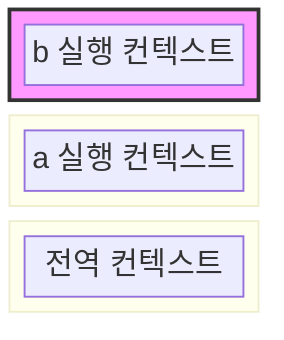
            
    4. b 함수 실행이 종료된 후 `콜스택에서 b 함수의 실행 컨텍스트가 제거`된다.
        1. b 함수 실행 컨텍스트가 제거됐으므로 a 함수의 실행 컨텍스트를 중단지점부터 재실행한다.
    5. 4번과 마찬가지로 a 함수 실행이 끝났으므로 `a 함수의 실행 컨텍스트가 제거`된다.
    6. 이후 전역 공간에 실행할 코드가 남아있지 않다면 콜스택에서 `전역 컨텍스트 또한 제거`된다.
    

## Record

JS는 코드를 실행하기 `전`에 식별자를 수집한다.

식별자 정보들는 `매개변수 식별자`, `함수 자체`, `함수 내부의 식별자` 등이 있다.

코드가 실행되기 전에 JS 엔진은 이미 실행 컨텍스트에 속한 변수명을 모두 알고있게 된다.

즉, `hositing`이 발생한다.

### var 호이스팅

```tsx
console.log(ecount);

var ecount = 1;

console.log(ecount);
```

1. **평가단계**
    
```json
    globalExecutionContext = {
    	lexicalEnvironment: {
    		environmentRecord: {
    			// 평가 과정을 통해서 식별자가 먼저 컬랙팅한 객체를 가지고 있으므로,
    			// undefined 가 할당이 된다.
    			// 자바스크립트 엔진이 Execution Context를 생성할 때,
    			// 암묵적으로 undefined 라는 값을 할당을 하기 때문이다.
    			ecount: **undefined**,
    			// 전역 컨텍스트 이기 때문에 global 객체를 가지고 있다.
    			// node 환경 global 객
    			// 브라우저 환경 window 객체
    			global: <global Object>,
    		},
    	
    		// outerReferenceEnvironment
    		// 자기 Execution context의 상위 스코프의 Lexcical Environment 를 참고한다.
    		// 전역 Execution context 이기 때문에 null 값이 들어가 있다.
    		outerReferenceEnvironment: null,
    	}
    }
```
    
2. **실행단계**
    
```json
    globalExecutionContext = {
    	lexicalEnvironment: {
    		environmentRecord: {
    			ecount: 1,
    			global: <global Object>,
    		},
    		outerReferenceEnvironment: null,
    	}
    }
```
    

### let, const 호이스팅

`var` 문은 실행 중인 실행 컨텍스트의 `Variable Environment`에 범위가 지정된 변수를 선언한다.

`var`변수는 포함하는 `Environment Record`가 인스턴스화 될 때 생성되며, 생성될 때 undefined로 초기화된다.

만약 `let/const` 변수 라면, 식별자 기록만 해두고, 값 초기화는 따로 진행하지 않는다.

이 부분을 구분하기 위해서 실행 컨텍스트를 저장할 때,

- **Lexical Environment**
    - Record: `let`, `const`로 선언된 변수나 `함수표현식`도 포함된다.
    - Outer: `Variable` Environment
- **Variable Environment**
    - Record : 현재 실행 컨텍스트 내에서 호이스팅이 발생되는 `var`, `함수선언문` 등을 저장한다.
    - Outer: `Outer` Environment
        
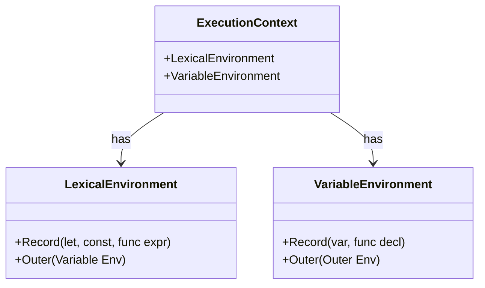
        

객체로 구분해서 관리한다.


그럼 왜 함수의 **Execution Context**를 **Lexical Environment**와 **Variable Environment**로 구별지어 나눈 걸까?

**첫 번째, 스코프의 차이점이다.**

아래 사진을 보면 알 수 있겠지만, let, const로 선언한 변수들의 경우 스코프 자체가 block scope이다.

그에 비해 var로 선언한 변수의 경우는 스코프가 functional scope이다.

```mermaid
flowchart LR
    subgraph BlockScope [Block Scope (let, const)]
        direction TB
        B1[if block]
        B2[for block]
        B3[while block]
    end
    subgraph FuncScope [Function Scope (var)]
        direction TB
        F1[Function Body]
    end
    BlockScope ~~~ FuncScope
```

이 차이점으로 인해 한 함수안에 여러 블록이 생긴다면 그 함수의 **Execution Context**에는 여러 **Lexical Environment**를 여러 개 만들어야 하는 상황이 만들어지기에 **Lexical Environment**와 **Variable Environment**를 구분 짓는 것이다.

예시로 아래와 같은 코드가 있다고 해보자.

```jsx
function Hi(){
    let let1 = 'I am let1';
    var var1 = 'I am var1';
    if(true){
         let let2 = 'I am let2';
         var var2 = 'I am var2';
    }
}
```

이 경우 아래 그림과 같이 Lexical Environment가 블록 기준으로 여러 개 생기게 될 것이다.

(함수 블록, if 블록)

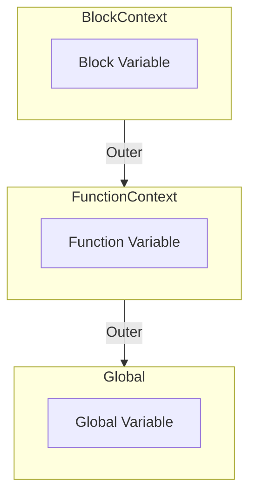

**두 번째, 차이점은 변수가 생성되는 과정이다.(TDZ 영향 여부)**

자바스크립트에서는 변수가 생성되는 과정이 3가지로 나누어진다.

1. **Declaration phase(선언 단계)** : 변수를 Execution Context의 Lexical Environment에 등록.

2. **Initialization phase(초기화 단계)** : Lexical Environment에 등록되어 있는 변수를 위하여 메모리를 할당하는 단계. 여기서 변수는 undefined 로 초기화된다.

3. **Assignment phase(할당 단계)** : 변수에 실제로 값이 할당되는 단계이다. (undefined → 특정한 값)

---

`let`, `const`와 `var`은 이 3가지 과정을 거치는 부분에서 또다시 차이가 발생하는데,

`var`의 경우 1번 선언 단계와 2번 초기화 단계가 동시에 진행되는데,

`let`, `const`는 1번 선언 단계만 먼저 진행된다.

1번 **Declaration phase(선언 단계)** 와 2번 **Initialization phase(초기화 단계)** 사이를 **TDZ(Temporal Dead Zone)이라고** 부르는데, 변수 생성 과정 차이로 인한 TDZ의 영향을 받느냐가 두 번째 차이점이다.

이 때문에 동작을 아예 다르게 해야 하는 것이고 그렇기에 **Lexical Environment**와 **Variable Environment**를 구분 짓는다.

<aside>
💡 **let, const 호이스팅**

*참고로 흔히들 말하는 "변수 선언 부가 스코프의 최상단으로 끌어올려진다"라는 특성인 "호이스팅(Hoisting)" 현상은 1번 **Declaration phase(선언 단계)** 때문에 발생하게 된다. let과 const 또한 **Declaration phase(선언 단계)는** 거치기에 호이스팅은 일어난다.*

*오류가 발생하는 이유는 TDZ에 영향을 받아 초깃값을 할당받지 못한 변수에 접근하려 하였기 때문일 뿐이지, 호이스팅이 일어나지 않는 것이 아니다.*

</aside>

실제로 Execution Context의 생성 과정은 크게 두 페이즈로 나누어진다.

**1. Creation Phase (Execution Context에 대한 정의 과정)**

**2. Execution Phase (코드를 실행하는 과정)**

첫 번째 페이즈인 Creation Phase에서 **Lexical Environment**와 **Variable Environment에** 대한 정의가 이루어지게 된다.

**Variable Environment**에서는 var로 선언된 변수를 변수 선언 1, 2단계(**Declaration phase, Initialization phase**) 모두 진행하기에 메모리에 매핑되고 undefined로 초기화까지 마치게 된다.

반면에 **Lexical Environment**의 경우는 `let`, `const`로 선언된 변수를 1단계(**Declaration phase**)만 진행하기에 **Variable Environment**와는 동작 방식에 차이가 있다.

결론적으로 위 두 가지 차이 때문에 **Lexical Environment**와 **Variable Environment로** 차이를 두는 것이다.

### 함수에서의 호이스팅

함수 선언은 화살표 함수로 변수에 담아 선언하는 **함수 표현식**과 직접 선언하는 **함수 선언문**이 있다.

```jsx
// 함수 표현식 (함수를 변수에 담아 사용)
const Func = () => {...}
var Func = () => {...}

// 함수 선언문
function Func() {...}
```

변수에 담아 사용하는 **함수 표현식의 경우**에는 호이스팅이 발생하여 **let, var, const에서의 호이스팅**과 동일하게 동작한다.

```jsx
// 함수 표현식 => ReferenceError: Cannot access 'ecount' before initialization
ecount();
const ecount = () => {}
```

```jsx
// 함수 표현식 => ecount is not a function
ecount();
var ecount = () => {}
```

하지만, **함수 선언문**으로 작성 시 **생성 단계에서 Record에 완성된 함수 객체가 생성, 기록**된다. 따라서 함수 선언 이전에 함수 호출 시 정상 동작이 된다.

```jsx
// 함수 선언문 => 정상 동작
ecount();
function ecount() {...}
```

## Outer

Js 스코프 체이닝 이해할 수 있다.

```jsx
let lamp = false;
function goTo2F() {
	let lamp = true;
	console.log(lamp);
}
goTo2F();
```

위 코드에서 JS 엔진은 goTo2F 함수에서 lamp의 값을 출력할 때 lamp가 지역변수, 전역변수 중 어느 값을 읽어야할지 결정이 필요하다. 이런 상황에서 변수나 함수의 값을 결정하는 것을 `식별자 결정`이라고 한다.

이처럼 콜스택 안에 동일한 식별자가 여러 개 일 때 JS 엔진은 `Outer`를 활용해 의사 결정을 한다.

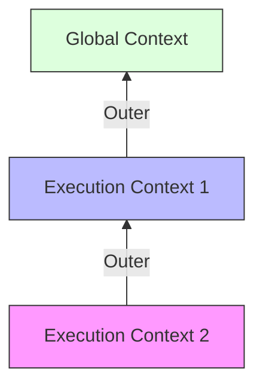

그림으로 표현한 Outer. 실행 컨텍스트 사이를 지나갈 수 있게 해주는 통로 역할을 한다.

1. goTo2F 함수 호출 시 goTo2F에 대한 실행 컨텍스트를 생성하고 JS 엔진은 새로 생성된 실행 컨텍스트에 바깥 렉시컬 환경으로 돌아갈 수 있는 `Outer`를 남겨놓는다.
2. lamp의 값을 출력하려고 하면 JS 엔진은 lamp의 값을 결정하기 위해 `환경 레코드`를 살펴본다.
3. `현재 활성화된 환경레코드`에서 lamp를 찾는다. lamp가 있다면 해당 값을 출력하고 더 이상 내려가지 않는다.
    1. 위의 경우처럼 동일한 식별자로 인해 상위 스코프에서 선언된 식별자의 값이 가려지는 현상을 `변수 섀도잉`이라고 한다.
4. lamp 값이 현재 활성화된 환경 레코드에 존재하지 않을 시 `Outer`를 통해 `외부 환경에 접근`하게 되고 여기서 lamp의 값을 찾게된다.
5. 이때 모든 실행 컨텍스트에서 찾지 못하게 된다면 `전역 실행 컨텍스트`의 렉시컬 환경을 참조하게 되고 여기에도 `없다면 reference error`를 발생한다.